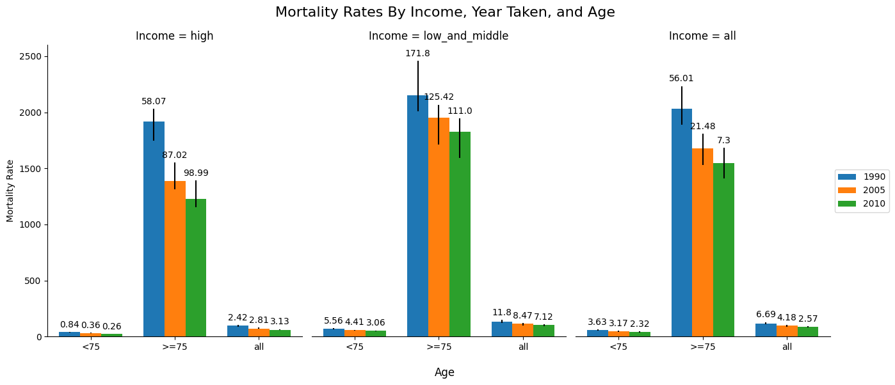

# Homework 1

### John Peters

### 10/17/24

- Make a graph of the mortality values (by age group, year, and country income group). Focus on the rates and intervals.

- Discuss your design choices. (Why did you choose this particular graph?)

I chose this particular graph because it makes it really easy to see the story that's present in the data. We see here, a great stratification between income and age. My graph is a simple bar chart, with hue'd groupings on the year of the data, and wider groupings on the age groups. This lets the user very quickly identify what income group they want to look at, and then what ages as well.

This seemed like a good way to organize this data based on the provided table.

Additionally, I added error bars, that extend asymmetrically from the point of the bar chart showing the min interval and max interval, with text over the bars describing the range of the interval, to get an idea of what type of deviation is present in the data.

- How would you make a comprehensive graph that includes all of the information in the table?

I would modify my graph so that instead of bars, I would use little icons that represent the other outcomes. Like stars, circles and so on.

Slightly offset, and with the error bars would make a little busy of a graph, but it would let me place everything in the same format that I started in. I think it would work alright. Maybe in the sub-graphs I could have little lines going from the proper shapes (with it restarting again each income level). It would be a little difficult to design in code, but I think it would look decent and be pretty readable.

- Put any code in an appendix.

Code can be found in the homework1 folder, alongside this markdown document.

