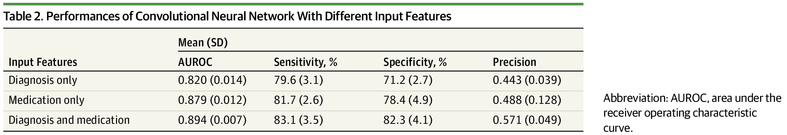

# Homework 1

### John Peters

### 11/26/24

## **1:** If a test has sensitivity = 80% and specificity 80% and the prevalence of the disease is 9/100,000, what is the positive predictive value (aka “precision”) of the test?

To calculate the precision, we need the true positives and false positives of the data. We see that the number of TP is the prevalence * sensitivity * population = 0.00009 * 0.8 * 100,000 = 7.2. 

Next we need the false positives. We see that the number of FP in our sample is (1 - prevalence) * (1 - specificity) * population = (1-0.00009) * 0.2 * 100,000 = 19,998.2. 

We then find the precision with: $\frac{TP}{(TP + FP)}$ = $\frac{7.2}{(7.2 + 19,998.2)}$ = 0.0003599.

## **2:** Suppose sensitivity = specificity. What would they have to be to achieve positive predictive value = 50% when prevalence is 9/100,000?

Using the equations we defined above, we see that precision (positive predictive value) = $\frac{TP}{(TP + FP)}$ = (prevalence * sensitivity) / ((prevalence * sensitivity) + (1 - prevalence) * (1 - specificity))

Because sensitivity = specificity we will define them both as x, and fill in the rest of the values:

$0.5 = 0.00009x / (0.00009x + 0.99991 - 0.99991x)$<br>
$0.5 = 0.00009x / (0.99991 - 0.99982x)$<br>
$0.5 * (0.99991 - 0.99982x) = 0.00009x$<br>
$0.499955 - 0.49991x = 0.00009x$<br>
$0.499955 = 0.5x$<br>
$x = 0.99991$<br>

## **3:** Comment on these results in relation to the precision values provided in Table 2 of Wang et al. (2019).

In this table:


Using this table in isolation, we can understand the prevalence rate through the relationships of the rates we solved for above. Since they have a fairly low specificity and sensitivity, their prevalence should be quite high, compared to the one used in our example, to find the numbers they present. 

If the prevalence rate was closer to 9/100,000 as was in our example, they would've needed vastly higher specificity and sensitivity rates to score the precision the table presents. 

Looking at what is presented in the paper: 

```
A total of 1829 patients with nonmelanoma skin cancer as their first diagnosed cancer and 7665 random controls without cancer were included in the analysis.
```

We find that the proportion of true positives is very high in the training set, as expected by looking at the provided numbers in the table. 

Using the results we gathered, it would be nothing short of disastrous to deploy a model like this in any setting that seeks to diagnose nonmelanoma skin cancer at scale. The false positive rate would be much too high.